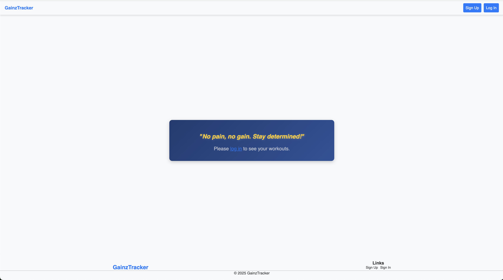
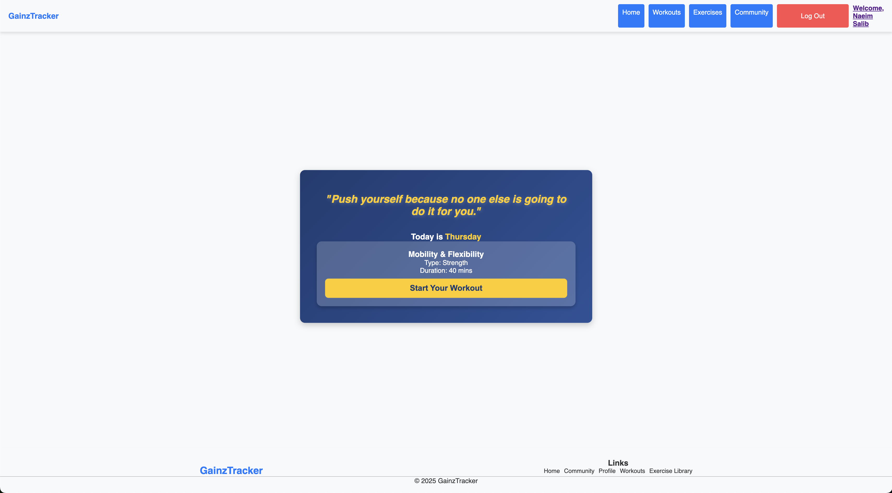
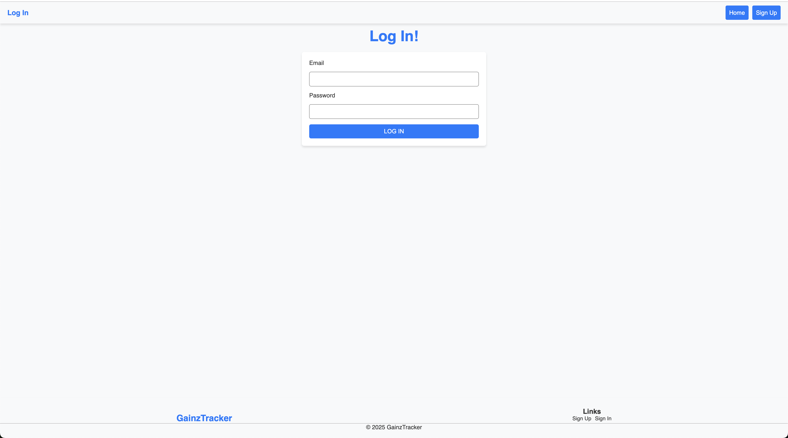
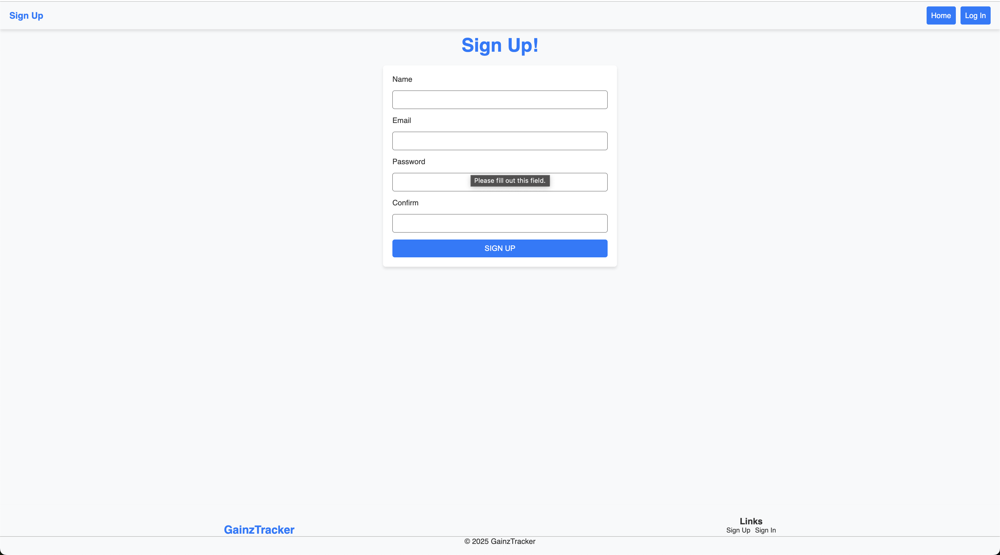
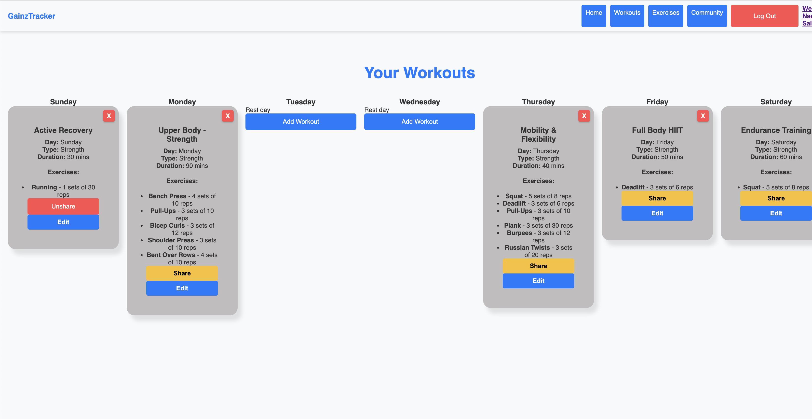
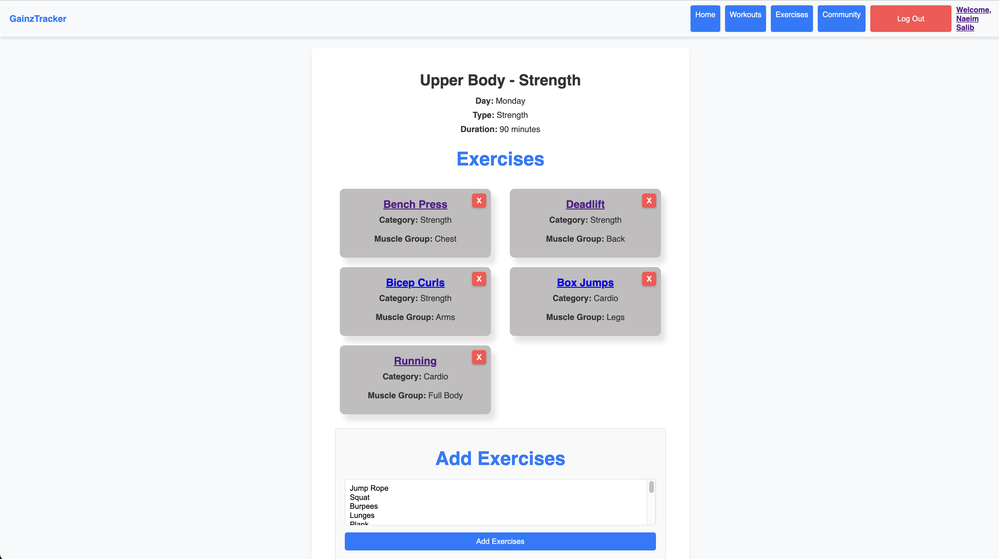
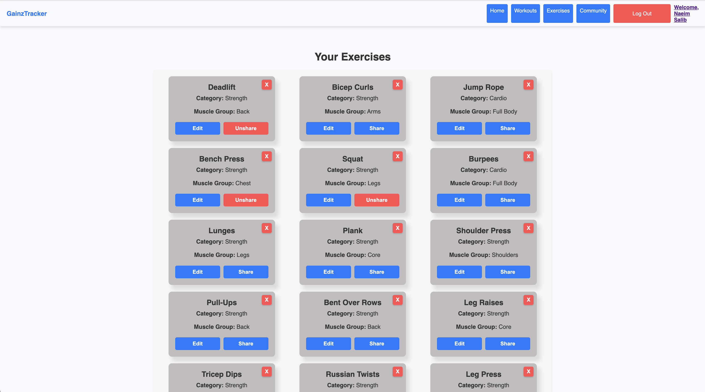
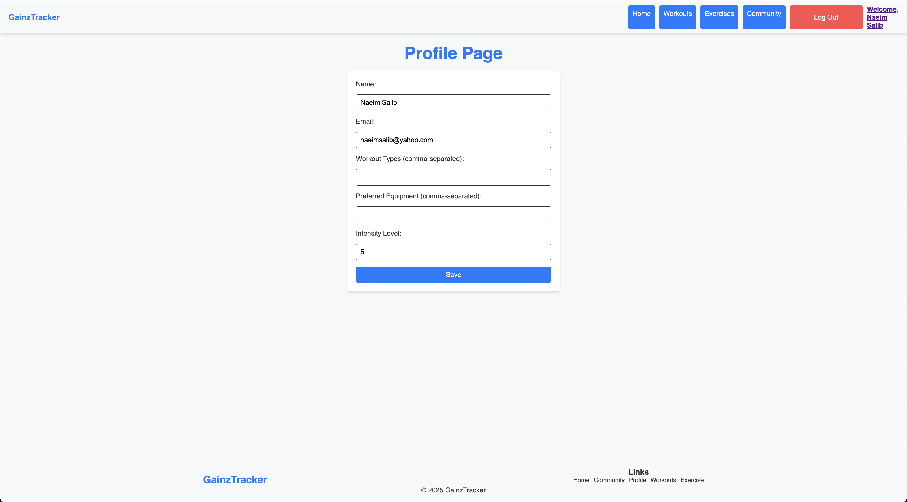

# Gainz Tracker

Gainz Tracker is a web application designed to help users track their workouts and exercises. The application allows users to create, edit, and delete workouts, as well as add exercises to their workouts. Users can also share their workouts with the community and save shared workouts to their own accounts.

## Demo

[Gainz Tracker Demo](https://gainz-tracker-56ecdfa3c0f4.herokuapp.com/)

## Features

- User authentication (login and signup)
- Create, edit, and delete workouts
- Add exercises to workouts
- Remove exercises from workouts
- Share workouts with the community
- Save shared workouts to user account
- View all workouts and exercises

## Pages

### Home Page

The home page provides an overview of the application and allows users to navigate to different sections of the app.




### Login Page

The login page allows users to log in to their account using their email and password.



### Signup Page

The signup page allows new users to create an account by providing their name, email, and password.



### Workout Page

The workout page displays all the workouts for the logged-in user. Users can add new workouts, edit existing workouts, and delete workouts. Each workout is displayed in a card format with the workout details.



### Workout Detail Page

The workout detail page displays the details of a specific workout, including the exercises linked to the workout. Users can add exercises to the workout, remove exercises from the workout, and edit the workout details.



### Exercise Page

The exercise page displays all the exercises available in the application. Users can view the details of each exercise and add exercises to their workouts.



### Profile Page

The profile page displays the user's profile information and allows users to update their profile details.



## Installation

To run the Gainz Tracker web app locally, follow these steps:

1. Clone the repository:
   ```bash
   git clone https://github.com/yourusername/gainz-tracker.git
   ```
2. Navigate to the project directory:
   ```bash
   cd gainz-tracker
   ```
3. Install the dependencies:
   ```bash
   npm install
   ```
4. Set up the environment variables: Create a `.env` file in the root directory and add the following environment variables:
   ```env
   MONGODB_URI=your_mongodb_uri
   SECRET=your_secret_key
   ```
5. Start the development server:
   ```bash
   npm start
   ```
6. Open your browser and navigate to `http://localhost:3000`.

## Technologies Used

- React
- Node.js
- Express
- MongoDB
- Mongoose
- JWT (JSON Web Token) for authentication
- CSS for styling

## Contributing

Contributions are welcome! Please fork the repository and submit a pull request for any improvements or bug fixes.
